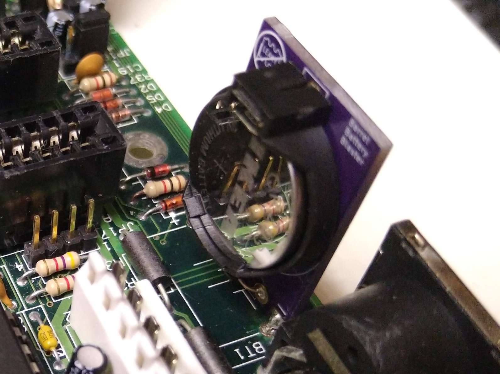
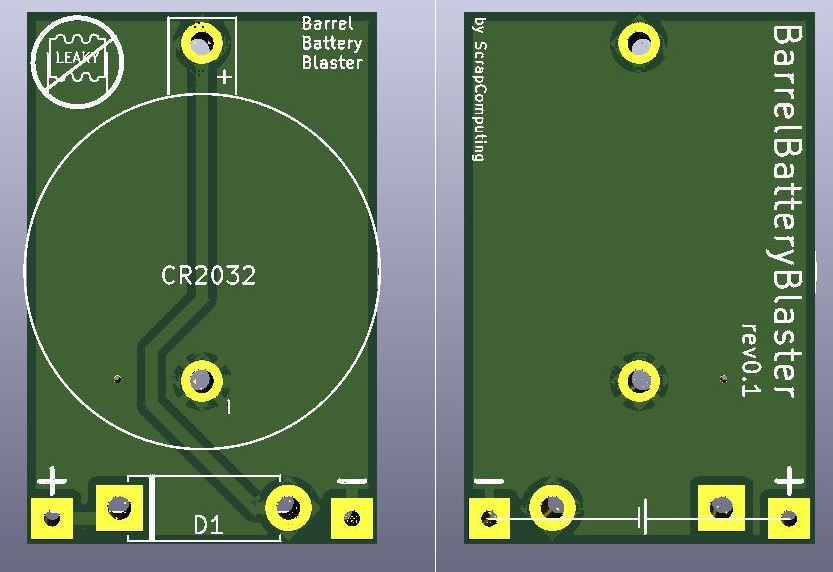

# Barrel Battery Blaster

Barrel Battery Blaster is a small PCB for replacing old rechargeable barrel-type CMOS batteries with non-rechargeable CR2032 Lithium batteries.
Such barrel batteries were quite common on vintage computer motherboards up until the 486 era.
These barrel batteries tend to leak, damaging the motherboard and the surrounding components.

# Bill of materials

Item                                           | #   | Description
-----------------------------------------------|-----|-----------------------------------------
Pins out of an angled male header 2.54mm pitch | 2   | For connecting the BarrelBatteryBlaster to the motherboard
Horizontally mounted CR2032 battery holder     | 1   | For the CR2032 Lithium battery
Diode (preferably schottky)                    | 1   | To prevent the Lithium battery from being charged by the motherboard

